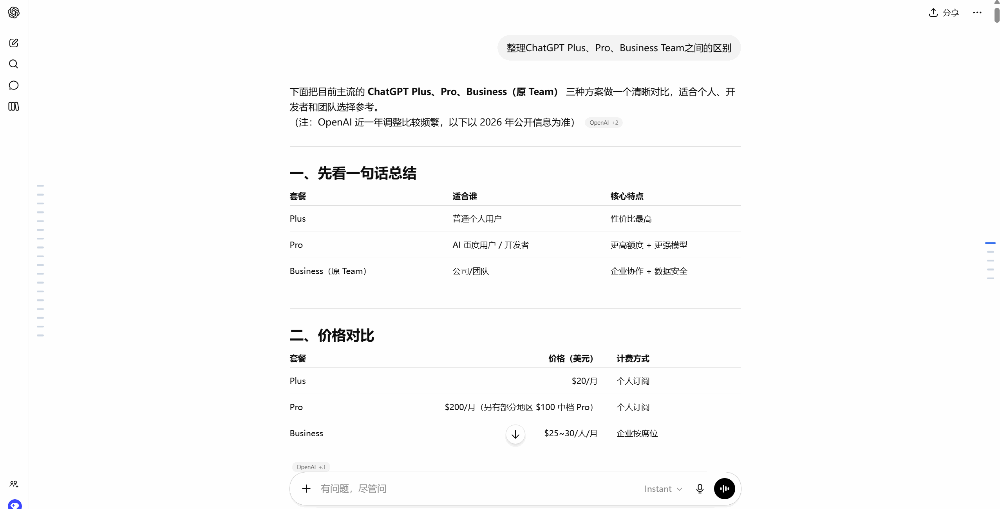

# ChatGPT-helper

一款 Chrome 浏览器插件，支持在 `chatgpt.com` 网站右侧展示当前会话中的用户问题，并在左侧展示当前 AI 回复的消息大纲。

## 展示



## 功能

- 自动提取当前会话中的用户提问，右侧卡片式目录展示
- 点击问题目录项直接跳转到对应问题
- 页面滚动时自动高亮当前问题
- 自动识别当前浏览到的 AI 回复，在左侧展示消息大纲
- 点击消息大纲中的标题可跳转到对应章节
- 支持普通会话，以及项目内会话等带有聊天消息的页面

## 目录结构

```text
.
|-- manifest.json
|-- assets
|   |-- icon-16.png
|   |-- icon-32.png
|   |-- icon-48.png
|   |-- icon-128.png
|   `-- icon.svg
`-- src
    `-- content
        |-- dom-adapter.js
        |-- index.js
        |-- message-outline.js
        |-- sidebar.js
        `-- styles.css
```

## 本地安装

1. 下载到本地，示例目录：D:\workspace\ChatGPT-helper
2. 打开 Chrome，进入 `chrome://extensions/`
3. 打开右上角“开发者模式”
4. 点击“加载已解压的扩展程序”
5. 选择当前目录 `D:\workspace\ChatGPT-helper`

## 使用说明

1. 安装后打开 `https://chatgpt.com/`
2. 进入任意一个已有会话，或项目中的某个会话
3. 页面右侧会出现“问题目录”刻度条
4. 点击任一问题可快速跳转到对应问题
5. 向上或向下滚动会话，右侧问题目录高亮项会自动同步
6. 浏览到包含 `h1-h6` 标题的 AI 回复时，页面左侧会出现“消息大纲”刻度条
7. 鼠标移入左侧刻度条可展开当前 AI 回复的标题列表，点击标题可跳转到对应章节

## 说明

- 仅支持 `chatgpt.com` 网站
